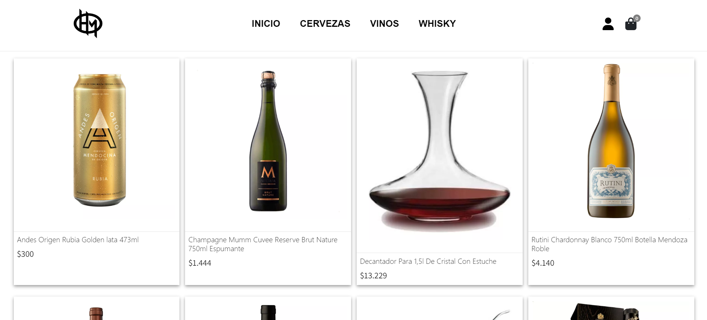
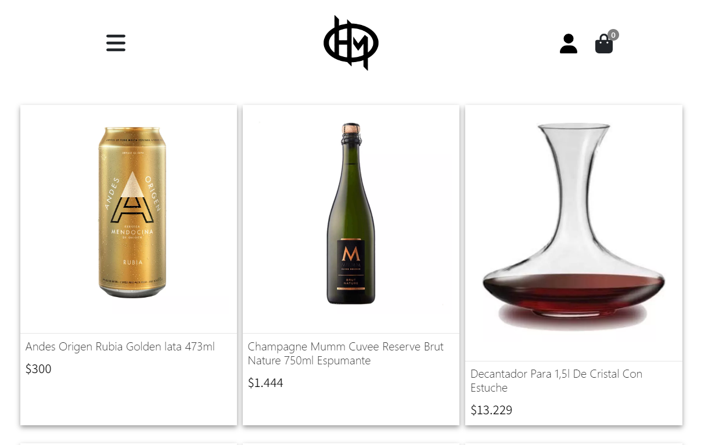

# HIGH MARKETPLACE
¡Bienvenido a High Marketplace! Este es un e-commerce especializado en la venta de bebidas alcohólicas de alta calidad. Aquí encontrarás una amplia selección de vinos, cervezas, licores y destilados para satisfacer tus gustos y preferencias. Desde vinos tintos robustos hasta licores artesanales exclusivos, tenemos todo lo que necesitas para disfrutar de una experiencia de compra única.

DEMO: https://regal-dango-6b02b9.netlify.app

### Características principales

##### - Catálogo diverso: 
Explora nuestro extenso catálogo de bebidas alcohólicas, organizado en categorías para facilitar tu búsqueda. Desde vinos de diferentes regiones hasta cervezas artesanales de edición limitada, ofrecemos una amplia gama de productos.

##### - Información detallada:
Obtén información detallada sobre cada producto, incluyendo descripciones, notas de cata, puntuaciones y opiniones de otros clientes. Esto te ayudará a tomar decisiones informadas y descubrir nuevas bebidas que se adapten a tus gustos.
 
##### - Proceso de compra seguro:
 Nuestra plataforma de e-commerce utiliza un sistema de seguridad robusto para proteger tus datos personales y financieros. Puedes estar tranquilo sabiendo que tus transacciones son seguras.
 
##### - Opciones de pago flexibles:
Aceptamos diversas formas de pago, incluyendo tarjetas de crédito, transferencias bancarias y servicios de pago en línea populares. Elige la opción que más te convenga y completa tu compra de manera sencilla y rápida.

#### - Envío rápido y confiable: 
Trabajamos con empresas de logística confiables para asegurarnos de que tus pedidos sean entregados de manera rápida y segura. Ofrecemos opciones de envío estándar y express para que puedas recibir tus bebidas según tus necesidades.

#### - Promociones y ofertas especiales:
Mantente al tanto de nuestras promociones y ofertas especiales para aprovechar descuentos exclusivos en productos seleccionados. Suscríbete a nuestro boletín informativo para recibir las últimas novedades directamente en tu bandeja de entrada.

### Herramientas utilizadas
- HTML5
- CSS3
- BOOTSTRAP
- JAVASCRIPT
- REACT VITE
- FIREBASE
- GITHUB